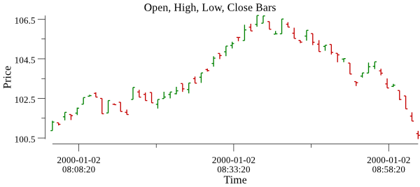
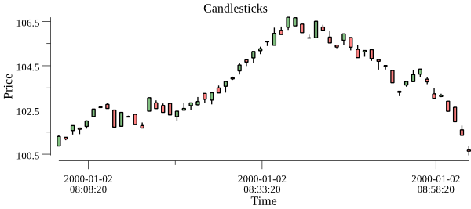
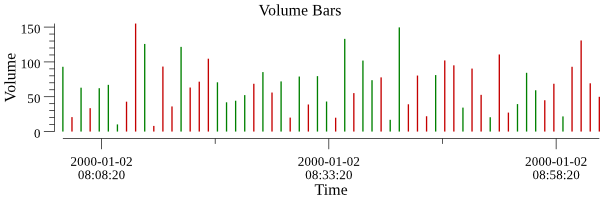
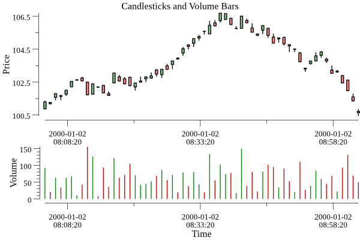

# plotext

**Plot** **ext**ensions and custom plotters for the [github.com/gonum/plot](https://github.com/gonum/plot) packages.

## Custom plotters

The `custplotter` package contains some **cus**tom **plotter**s which can be used to create financial charts with golang using the `gonum/plot` package.

### OHLC bars plotter

The example code in `plotext/examples/ohlcbars/main.go` shows how a plot containing an OHLC bar chart can be created:

### Candlesticks plotter

The example code in `plotext/examples/candlesticks/main.go` shows how a plot containing a candlestick chart can be created:

### Volume bars plotter

The example code in `plotext/examples/vbars/main.go` shows how a plot containing a volume bar chart can be created:

## Extensions

### Alignment of plots with proportions

The `plotext` package contains an extended `Align` function which can be used to align e.g. an OHLC bar cart and a volume bar chart vertically while providing e.g. 2/3 of the available height for the OHLC chart and 1/3 of the height for the volume chart.

